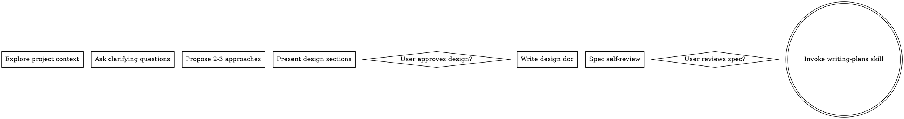
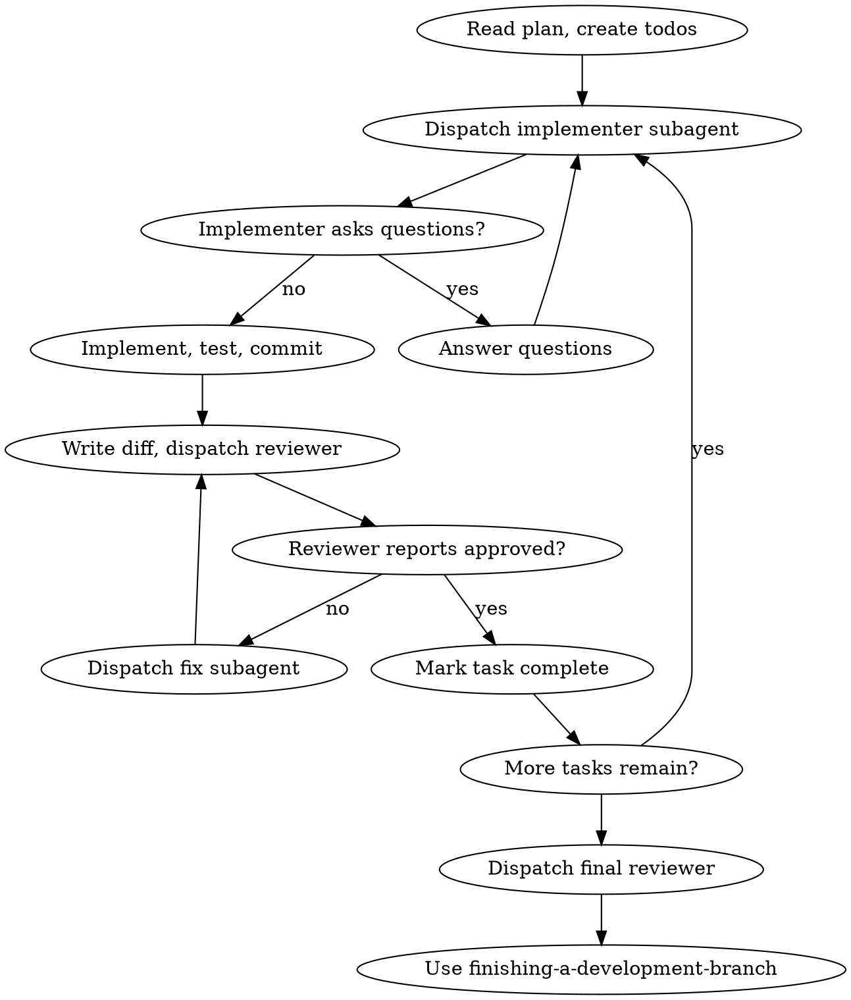

# Superpowers Skill 源码分析

本文档分析 Superpowers 相关的所有 Skill 源码，包括 `comet-design`、`comet-build`、`comet-verify`、`comet-hotfix`、`comet-tweak` 以及核心的执行技能。

---

## 1. Superpowers 架构总览

```
┌─────────────────────────────────────────────────────────────────────┐
│                        Superpowers 架构                             │
├─────────────────────────────────────────────────────────────────────┤
│                                                                     │
│   ┌──────────────────────────────────────────────────────────────┐ │
│   │                     核心流程技能                              │ │
│   │                                                              │ │
│   │  ┌──────────┐   ┌──────────┐   ┌──────────┐   ┌──────────┐   │ │
│   │  │ comet-   │──▶│ comet-   │──▶│ comet-   │──▶│ comet-   │   │ │
│   │  │ design   │   │ build    │   │ verify   │   │ archive  │   │ │
│   │  │(Phase 2) │   │(Phase 3) │   │(Phase 4) │   │(Phase 5) │   │ │
│   │  └──────────┘   └──────────┘   └──────────┘   └──────────┘   │ │
│   │                                                              │ │
│   │  ┌──────────┐   ┌──────────┐                               │ │
│   │  │ comet-   │   │ comet-   │  (预设路径)                    │ │
│   │  │ hotfix   │   │ tweak    │                               │ │
│   │  └──────────┘   └──────────┘                               │ │
│   │                                                              │ │
│   └──────────────────────────────────────────────────────────────┘ │
│                          │                                          │
│                          ▼                                          │
│   ┌──────────────────────────────────────────────────────────────┐ │
│   │                     执行技能层                                │ │
│   │                                                              │ │
│   │  ┌────────────────┐   ┌────────────────┐                    │ │
│   │  │ subagent-driven│   │ executing-plans│                    │ │
│   │  │ -development   │   │                │                    │ │
│   │  │ (子代理驱动)    │   │ (并行会话)      │                    │ │
│   │  └────────────────┘   └────────────────┘                    │ │
│   │                                                              │ │
│   └──────────────────────────────────────────────────────────────┘ │
│                          │                                          │
│                          ▼                                          │
│   ┌──────────────────────────────────────────────────────────────┐ │
│   │                     基础技能层                                │ │
│   │                                                              │ │
│   │  ┌──────────┐   ┌──────────┐   ┌──────────┐   ┌──────────┐   │ │
│   │  │brainstorm│   │writing-  │   │finishing-│   │using-git │   │ │
│   │  │   ing    │   │ plans    │   │ a-branch│   │worktrees │   │ │
│   │  └──────────┘   └──────────┘   └──────────┘   └──────────┘   │ │
│   │                                                              │ │
│   └──────────────────────────────────────────────────────────────┘ │
│                                                                     │
└─────────────────────────────────────────────────────────────────────┘
```

---

## 2. comet-design Skill 源码分析

### 2.1 文件位置
```
~/.claude/skills/comet-design/SKILL.md
```

### 2.2 核心功能
**Phase 2: 深度设计** - 通过 brainstorming 产出 Design Doc 和 delta spec

### 2.3 工作流程源码解析

#### Step 0: 入口状态验证

```bash
bash "$COMET_STATE" check <name> design
```

**检查项**:
- 活跃 change 已存在
- 无 Design Doc（docs/superpowers/specs/ 下无对应文件）
- .comet.yaml 中 phase=design
- workflow=full

#### Step 1a: 读取已有上下文

```yaml
读取活跃 change 下的 proposal.md 和 design.md
整理为摘要：
  - proposal 摘要: 目标、动机、范围
  - design 摘要: 架构决策、高层设计
```

#### Step 1b: 执行 Brainstorming

```yaml
立即执行: 使用 Skill 工具加载 `superpowers:brainstorming` 技能
参数:
  Change: <change-name>
  Proposal 摘要: <proposal 核心内容>
  Design 摘要: <design.md 架构决策>
  跳过上下文探索，直接进入设计提问

禁止跳过此步骤
```

**brainstorming Skill 核心流程**:



**关键约束**:
```yaml
HARD-GATE:
  在呈现设计并获得用户批准之前，
  禁止调用任何实现技能、编写代码、搭建项目或执行实现操作
```

#### Step 2: 更新 Comet 状态

```bash
# 记录 design_doc 路径
bash "$COMET_STATE" set <name> design_doc \
  docs/superpowers/specs/YYYY-MM-DD-topic-design.md

# 自动流转到下一阶段
bash $COMET_GUARD <change-name> design --apply
```

#### Step 3: 双 Spec 分工

| Spec 类型 | 归属 | 存放位置 | 定义 |
|-----------|------|---------|------|
| 能力规格 | OpenSpec | openspec/changes/<name>/specs/ | 系统应该做什么 |
| 设计文档 | Superpowers | docs/superpowers/specs/ | 怎么构建 |

#### Step 4: 文档层级

```
proposal.md（阶段 1）           → Why + What
design.md（阶段 1，OpenSpec）   → 高层架构决策
设计文档（阶段 2，Superpowers） → 深度技术设计
能力规格（阶段 2，delta）       → 需求 + 验收场景
```

---

## 3. comet-build Skill 源码分析

### 3.1 文件位置
```
~/.claude/skills/comet-build/SKILL.md
```

### 3.2 核心功能
**Phase 3: 计划与构建** - 制定计划并通过各种执行模式实施

### 3.3 工作流程源码解析

#### Step 0: 入口状态验证

```bash
bash "$COMET_STATE" check <name> build
```

**检查项**:
- Design Doc 已创建
- .comet.yaml 中 phase=build
- design_doc 字段非空且文件存在

#### Step 1: 制定计划

```yaml
立即执行: 使用 Skill 工具加载 `superpowers:writing-plans` 技能

计划要求:
  - 保存至: docs/superpowers/plans/YYYY-MM-DD-<feature>.md
  - 引用设计文档，拆分为可执行任务
  - Plan 文件头必须包含关联元数据:

    ---
    change: <openspec-change-name>
    design-doc: docs/superpowers/specs/YYYY-MM-DD-<topic>-design.md
    ---
```

**writing-plans Skill 核心结构**:

```markdown
# Plan 文档结构

> **For agentic workers:** REQUIRED SUB-SKILL: 
> Use superpowers:subagent-driven-development (recommended) 
> or superpowers:executing-plans

**Goal:** [一句话描述]
**Architecture:** [2-3 句话]
**Tech Stack:** [关键技术]

## Global Constraints
[项目级需求]

### Task N: [组件名]
**Files:**
- Create: `exact/path/to/file.py`
- Modify: `exact/path/to/existing.py:123-145`
- Test: `tests/exact/path/to/test.py`

**Interfaces:**
- Consumes: [使用的接口]
- Produces: [提供的接口]

- [ ] **Step 1: Write the failing test**
- [ ] **Step 2: Run test to verify it fails**
- [ ] **Step 3: Write minimal implementation**
- [ ] **Step 4: Run test to verify it passes**
- [ ] **Step 5: Commit**
```

#### Step 2: 更新计划状态

```bash
bash "$COMET_STATE" set <name> plan docs/superpowers/plans/YYYY-MM-DD-feature.md
```

#### Step 3: 工作区隔离

**隔离方式选择**:

| 选项 | 方式 | 说明 | 推荐场景 |
|------|------|------|----------|
| A | branch | 创建新分支 | 变更 ≤ 3 个文件 |
| B | worktree | 隔离工作区 | 并行开发、有未提交工作 |

```bash
bash "$COMET_STATE" set <name> isolation <value>
# value: branch | worktree
```

**执行隔离**:
- **branch**: `git checkout -b <change-name>`
- **worktree**: 调用 `superpowers:using-git-worktrees` 技能

#### Step 4: 选择执行方式

**执行方式选择**:

| 选项 | 技能 | 适用场景 | 推荐规则 |
|------|------|----------|----------|
| A | subagent-driven-development | 任务独立、复杂度高 | 任务数 ≥ 3 |
| B | executing-plans | 任务简单、无子 agent | 任务数 ≤ 2 |

```bash
bash "$COMET_STATE" set <name> build_mode <value>
# value: subagent-driven-development | executing-plans | direct
```

#### Step 5: Spec 增量更新

**变更规模分级处理**:

| 规模 | 触发条件 | 做法 |
|------|---------|------|
| 小 | 遗漏验收场景、边界条件 | 直接编辑 delta spec + design.md |
| 中 | 接口变更、新增组件、数据流变化 | 重新 brainstorming 更新 Design Doc |
| 大 | 全新 capability 需求 | 创建独立 change |

**50% 阈值判定**:
- 以 tasks.md 初始任务总数为基准
- 新增任务超过 50% → 考虑拆分为新 change

---

## 4. comet-verify Skill 源码分析

### 4.1 文件位置
```
~/.claude/skills/comet-verify/SKILL.md
```

### 4.2 核心功能
**Phase 4: 验证与收尾** - 验证实现符合设计，处理开发分支

### 4.3 工作流程源码解析

#### Step 0: 入口状态验证

```bash
bash "$COMET_STATE" check <name> verify
```

#### Step 1: 改动规模评估

```bash
bash "$COMET_STATE" scale <name>
```

**scale 脚本逻辑** (来自 comet-state.sh):

```bash
cmd_scale() {
  # 统计指标
  task_count=$(grep -c '^\- \[' "$tasks_file")
  delta_spec_count=$(find "$change_dir/specs" -name "spec.md" | wc -l)
  changed_files=$(git diff --stat HEAD | grep -o '[0-9]\+ file')

  # 决策规则
  if [ "$task_count" -gt 3 ] || 
     [ "$delta_spec_count" -gt 1 ] || 
     [ "$changed_files" -gt 5 ]; then
    result="full"
  else
    result="light"
  fi

  sed -i "s/^verify_mode:.*/verify_mode: $result/" "$yaml_file"
}
```

#### Step 2a: 轻量验证 (Light)

**适用条件**:
- 规模评估结果为"小"
- 跳过 `openspec-verify-change`

**检查项**:
1. tasks.md 全部任务已完成 `[x]`
2. 改动文件与 tasks.md 描述一致
3. 编译通过
4. 相关测试通过
5. 无明显安全问题

**通过标准**: 5 项全部 OK

#### Step 2b: 完整验证 (Full)

**适用条件**: 规模评估结果为"大"

**检查项**:
1. tasks.md 全部任务已完成
2. 实现符合 design.md 设计决策
3. 实现符合 brainstorming 设计文档
4. 能力规格场景全部通过
5. proposal.md 目标已满足
6. delta spec 与 design doc 无矛盾
7. docs/superpowers/specs/ 关联的设计文档可定位

**Spec 漂移处理**:
```yaml
若发现矛盾 (delta spec 有内容但 design doc 未体现):
  选项 A: 在 design doc 追加 "Implementation Divergence" 节
  选项 B: 回退到 Build 阶段，补充 brainstorming
  选项 C: 确认偏差可接受，继续验证
```

#### Step 3: 收尾 (Superpowers)

```yaml
立即执行: 使用 Skill 工具加载 `superpowers:finishing-a-development-branch` 技能

分支处理选项:
  1. 本地合并到主分支
  2. 推送并创建 PR
  3. 保持分支（稍后处理）
  4. 丢弃工作
```

---

## 5. 预设路径分析

### 5.1 comet-hotfix (热修复)

#### 适用条件
```yaml
必须全部满足:
  1. 修复已有功能的 bug，不新增 capability
  2. 不涉及接口变更或架构调整
  3. 改动范围可预估（通常 < 5 个文件）
```

#### 流程差异

| 阶段 | 完整流程 | Hotfix |
|------|---------|--------|
| Phase 1 | Open + explore | 精简开启（跳过 explore） |
| Phase 2 | Design (brainstorming) | 跳过 |
| Phase 3 | Build (选择执行方式) | Direct 构建 |
| Phase 4 | Verify (评估规模) | 复用 comet-verify |
| Phase 5 | Archive | 复用 comet-archive |

#### 初始化差异

```bash
# 完整流程
bash "$COMET_STATE" init <name> full
# phase: design

# Hotfix
bash "$COMET_STATE" init <name> hotfix
# phase: build
# build_mode: direct
# verify_mode: light
```

#### 升级条件

```yaml
满足任一即升级为完整 /comet:
  - 改动涉及 3+ 文件
  - 架构变更（新模块、新接口、新依赖）
  - 数据库 schema 变更
  - 引入新的 public API
  - 修复范围超出单一函数/模块
```

### 5.2 comet-tweak (小调整)

#### 适用条件
```yaml
必须全部满足:
  1. 不新增 capability
  2. 不改变架构
  3. 不涉及接口变化
  4. 通常不超过 3 个 tasks、5 个文件
```

#### 与 Hotfix 的区别

| 特性 | Hotfix | Tweak |
|------|--------|-------|
| 目标 | Bug 修复 | 优化调整 |
| proposal | 问题描述 + 根因分析 | 变更动机 + 目标 |
| commit message | `fix: <描述>` | `tweak: <描述>` |
| Delta spec | 可能（改变验收场景） | 无需 |

#### 连续执行模式

```yaml
重要: Tweak 流程为一次性连续执行

执行顺序: 快速开启 → 轻量构建 → 轻量验证 → 归档 → 完成

特点:
  - 中间不停顿等待用户输入
  - 每个阶段完成后立即进入下一阶段
  - 除非遇到升级条件需要用户确认
```

---

## 6. 执行技能深度分析

### 6.1 subagent-driven-development

#### 核心机制

```
新鲜子代理 per 任务 + 任务审查（规格 + 质量）+ 广泛最终审查 = 高质量、快速迭代
```

#### 执行流程



#### 模型选择策略

| 任务类型 | 模型选择 | 说明 |
|----------|---------|------|
| 机械实现任务 | 快速、便宜模型 | 独立函数、清晰规格、1-2 文件 |
| 集成和判断任务 | 标准模型 | 多文件协调、模式匹配、调试 |
| 架构和设计任务 | 最强可用模型 | 需要广泛代码库理解 |
| 审查任务 | 根据 diff 大小/复杂度选择 | 小型机械 diff 不需要最强模型 |

#### 处理实现者状态

```yaml
DONE:
  生成审查包 -> 分派任务审查器

DONE_WITH_CONCERNS:
  实现者完成但有疑虑
  -> 阅读疑虑
  -> 如有关正确性或范围，在审查前处理
  -> 如是观察，记录并继续审查

NEEDS_CONTEXT:
  实现者需要未提供的信息
  -> 提供缺失上下文
  -> 重新分派

BLOCKED:
  实现者无法完成任务
  -> 评估阻塞:
     1. 上下文问题 -> 提供更多上下文
     2. 需要更多推理 -> 使用更强模型
     3. 任务太大 -> 拆分为更小的部分
     4. 计划错误 -> 上报给人类
```

#### 文件交接机制

```yaml
任务简报: scripts/task-brief PLAN_FILE N
  -> 提取任务全文到唯一命名文件
  -> 打印路径

报告文件: task-N-brief.md -> task-N-report.md
  -> 实现者写入完整报告
  -> 返回状态、提交、测试摘要、疑虑

审查器输入:
  - 简报文件（相同）
  - 报告文件
  - 审查包（git diff）
  - 全局约束
```

### 6.2 executing-plans

#### 与 subagent-driven-development 的区别

| 特性 | subagent-driven-development | executing-plans |
|------|---------------------------|-----------------|
| 会话 | 同一会话 | 并行会话 |
| 子代理 | 每个任务新鲜子代理 | 批量执行 |
| 审查 | 每个任务后审查 | 检查点审查 |
| 速度 | 更快迭代 | 需要会话切换 |
| 适用 | 任务独立 | 任务紧密耦合 |

#### 执行流程

```yaml
Step 1: 加载和审查计划
  - 读取计划文件
  - 批判性审查
  - 如有疑虑，与人类伙伴提出

Step 2: 执行任务
  每个任务:
    - 标记为 in_progress
    - 精确遵循每个步骤
    - 运行指定的验证
    - 标记为 completed

Step 3: 完成开发
  - 使用 finishing-a-development-branch 技能
  - 验证测试
  - 呈现选项
  - 执行选择
```

---

## 7. 基础技能分析

### 7.1 brainstorming

#### 核心流程

```yaml
1. Explore project context
   -> 检查文件、文档、最近提交

2. Offer the visual companion just-in-time
   -> 非预先提供，第一次需要时提供

3. Ask clarifying questions
   -> 一次一个问题

4. Propose 2-3 approaches
   -> 附带权衡和推荐

5. Present design
   -> 按复杂度缩放每个部分
   -> 每部分后询问是否正确

6. Write design doc
   -> docs/superpowers/specs/YYYY-MM-DD-<topic>-design.md
   -> 提交

7. Spec self-review
   -> Placeholder 扫描
   -> 内部一致性检查
   -> 范围检查
   -> 歧义检查

8. User reviews written spec
   -> 请求用户审查
   -> 如有变更，修改并重新审查

9. Transition to implementation
   -> 调用 writing-plans 技能
```

#### 硬约束 (HARD-GATE)

```yaml
禁止:
  - 在呈现设计并获得用户批准之前调用任何实现技能
  - 编写任何代码
  - 搭建任何项目
  - 执行任何实现操作

适用:
  - 每个项目，无论感知复杂度
  - todo list、单功能工具、配置变更都需要
```

### 7.2 writing-plans

#### 任务粒度

```yaml
每个步骤是一个动作 (2-5 分钟):
  - "Write the failing test" - step
  - "Run it to make sure it fails" - step
  - "Implement the minimal code to make the test pass" - step
  - "Run the tests and make sure they pass" - step
  - "Commit" - step
```

#### 禁止的占位符

```yaml
计划失败模式:
  - "TBD", "TODO", "implement later"
  - "Add appropriate error handling"
  - "Write tests for the above" (无实际测试代码)
  - "Similar to Task N" (应重复代码)
  - 无代码块描述做什么
  - 引用未在任何任务中定义的类型/函数/方法
```

### 7.3 finishing-a-development-branch

#### 环境检测

```bash
GIT_DIR=$(cd "$(git rev-parse --git-dir)" && pwd -P)
GIT_COMMON=$(cd "$(git rev-parse --git-common-dir)" && pwd -P)

状态判定:
  - GIT_DIR == GIT_COMMON: 普通仓库
  - GIT_DIR != GIT_COMMON, named branch: 命名分支 worktree
  - GIT_DIR != GIT_COMMON, detached HEAD: 分离 HEAD
```

#### 选项矩阵

| 选项 | 合并 | 推送 | 保留 Worktree | 清理分支 |
|------|------|------|---------------|----------|
| 1. 本地合并 | ✓ | - | - | ✓ |
| 2. 创建 PR | - | ✓ | ✓ | - |
| 3. 保持现状 | - | - | ✓ | - |
| 4. 丢弃 | - | - | - | ✓ (强制) |

#### Worktree 清理

```yaml
仅对选项 1 和 4 执行清理
选项 2 和 3 始终保留 worktree

清理流程:
  1. 先执行合并
  2. 确认成功
  3. 移除 worktree
  4. 删除分支

注意:
  - 从 worktree 内部运行 git worktree remove 会失败
  - 必须先 cd 到主仓库根目录
```

---

## 8. Superpowers 状态机

### 8.1 完整流程状态机

```
┌────────────────────────────────────────────────────────────────────────┐
│                      Superpowers 状态流转                              │
├────────────────────────────────────────────────────────────────────────┤
│                                                                        │
│  ┌─────────┐                                                          │
│  │  Entry  │                                                          │
│  │  Guard  │                                                          │
│  └────┬────┘                                                          │
│       │                                                               │
│       ▼                                                               │
│  ┌─────────┐    brainstorming    ┌─────────┐                         │
│  │  Design │ ───────────────────▶│  Doc    │                         │
│  │  Phase  │                    │ Created │                         │
│  └────┬────┘                    └────┬────┘                         │
│       │                               │                              │
│       │ comet-guard design --apply    │                              │
│       ▼                               │                              │
│  ┌─────────┐    writing-plans   ┌────┘                              │
│  │  Build  │ ───────────────────▶│                                  │
│  │  Phase  │                    │                                  │
│  └────┬────┘    选择执行方式:    │                                  │
│       │    subagent-driven/      │                                  │
│       │    executing-plans/      │                                  │
│       │    direct               │                                  │
│       │                         ▼                                  │
│       │    comet-guard      ┌─────────┐                            │
│       │    build --apply    │  Tasks  │                            │
│       ▼                     │  Done   │                            │
│  ┌─────────┐                └────┬────┘                            │
│  │ Verify  │                       │                                 │
│  │  Phase  │ ◀────────────────────┘                                 │
│  └────┬────┘                                                          │
│       │                                                               │
│       │ 规模评估: scale                                             │
│       │   ├─ light (≤3 tasks) → 轻量验证                          │
│       │   └─ full (>3 tasks)  → 完整验证                            │
│       │                                                               │
│       │ comet-guard verify --apply                                  │
│       ▼                                                               │
│  ┌─────────┐    finishing-a-branch   ┌─────────┐                  │
│  │ Archive │ ────────────────────────▶│  Done   │                  │
│  │  Phase  │                        │         │                  │
│  └────┬────┘                        └─────────┘                  │
│       │                                                               │
│       │ comet-archive.sh                                            │
│       ▼                                                               │
│  ┌─────────┐                                                          │
│  │Archived │                                                          │
│  └─────────┘                                                          │
│                                                                        │
└────────────────────────────────────────────────────────────────────────┘
```

### 8.2 状态转换条件

| 从 | 到 | 触发条件 | 自动操作 |
|----|-----|---------|----------|
| Design | Build | guard_open pass + --apply | phase=build |
| Build | Verify | guard_build pass + --apply | phase=verify, verify_result=pending |
| Verify | Archive | guard_verify pass + --apply | phase=archive, verify_result=pass, verified_at=now |

---

## 9. 关键设计模式

### 9.1 强制阶段检查

```yaml
每个阶段开始时:
  1. 运行入口验证: bash $COMET_STATE check <name> <phase>
  2. 验证失败则停止，输出原因
  3. 验证通过才继续
```

### 9.2 自动状态流转

```yaml
阶段完成时:
  1. 运行阶段守卫: bash $COMET_GUARD <name> <phase>
  2. 所有检查通过后
  3. 可选 --apply 自动更新状态
  4. 自动进入下一阶段（无需用户输入）
```

### 9.3 技能强制调用

```yaml
关键步骤标记:
  "立即执行：使用 Skill 工具加载 X 技能"
  "禁止跳过此步骤"
  
技能不可用时的行为:
  - 停止流程
  - 提示安装或启用对应技能
  - 不使用普通对话替代
```

### 9.4 规模自适应

```yaml
验证模式根据规模自动选择:
  - 小规模 → light 验证（5项快速检查）
  - 大规模 → full 验证（完整规格检查）

规模指标:
  - 任务数 > 3
  - Delta spec 数 > 1
  - 变更文件数 > 5
```

---

## 10. 与 OpenSpec 的协作接口

### 10.1 输入依赖

| Superpowers | 需要 OpenSpec 提供 |
|-------------|-------------------|
| comet-design | proposal.md, design.md (高层) |
| comet-build | .comet.yaml (design_doc 路径) |
| comet-verify | .comet.yaml (verify_result) |
| comet-archive | .comet.yaml (archived, verify_result) |

### 10.2 输出产物

| Superpowers | 产出文件 | OpenSpec 使用 |
|-------------|---------|---------------|
| comet-design | Design Doc | 归档时标注 |
| comet-build | Plan | 归档时标注 |
| brainstorming | delta spec | 归档时同步到 main spec |

### 10.3 元数据关联

```yaml
# Superpowers Plan 文件头
---
change: <openspec-change-name>
design-doc: docs/superpowers/specs/YYYY-MM-DD-topic-design.md
---

# OpenSpec .comet.yaml
design_doc: docs/superpowers/specs/YYYY-MM-DD-topic-design.md
plan: docs/superpowers/plans/YYYY-MM-DD-feature.md
```

---

## 11. 总结

### 11.1 Superpowers 核心职责

1. **技术设计** - 通过 brainstorming 产出 Design Doc
2. **计划制定** - 将设计拆分为可执行任务
3. **执行实现** - 通过子代理或并行会话实施
4. **质量验证** - 规格符合性 + 代码质量双重审查
5. **分支收尾** - 合并、PR、保留或丢弃工作

### 11.2 关键 Skill 文件

| Skill | 职责 | 关键特性 |
|-------|------|----------|
| comet-design | Phase 2 | brainstorming 强制调用 |
| comet-build | Phase 3 | 执行方式选择 (subagent/executing-plans/direct) |
| comet-verify | Phase 4 | 规模自适应验证 |
| comet-hotfix | 预设路径 | 跳过 brainstorming |
| comet-tweak | 预设路径 | 跳过 brainstorming + plan |
| subagent-driven-development | 执行 | 新鲜子代理 + 任务审查 + 最终审查 |
| executing-plans | 执行 | 批量执行 + 检查点 |
| brainstorming | 基础 | HARD-GATE 禁止提前实现 |
| writing-plans | 基础 | 无占位符要求 |
| finishing-a-branch | 基础 | 4选项分支处理 |

### 11.3 设计理念

- **Brainstorming 不可跳过** - 除 hotfix/tweak 外必须深度设计
- **显式优于隐式** - 所有执行方式必须显式选择
- **质量门槛** - 阶段守卫确保每个阶段质量
- **规模自适应** - 根据变更大小选择验证深度
- **自动化流转** - 阶段完成后自动进入下一阶段

---

**生成日期**: 2026-06-28  
**分析版本**: v1.0.0
